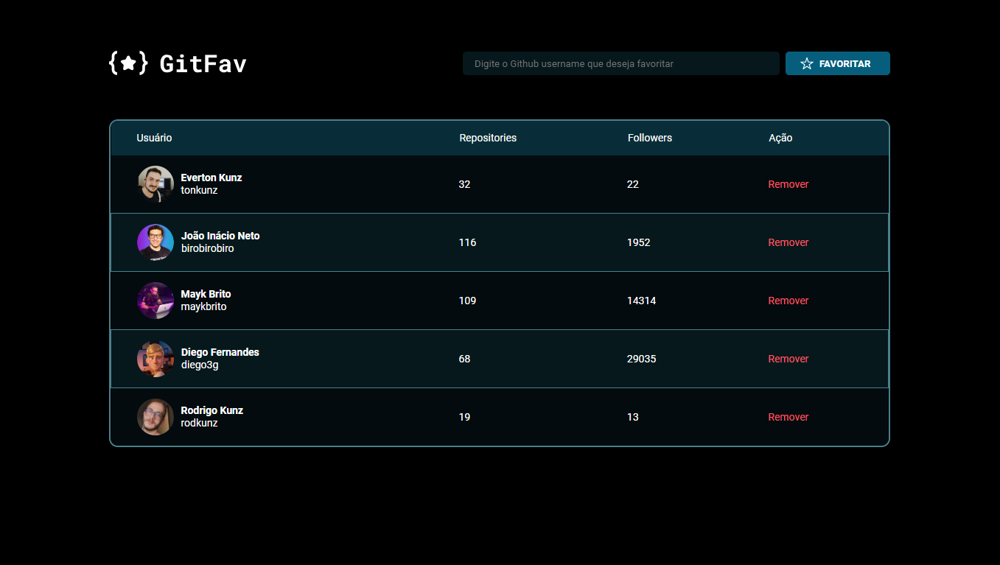

# 🚀 Trilha Explorer

> Desafio proposto durante o curso explorer, onde foi abordado e utilizado os:

`Conceitos de SPA`
`Mapeamento de rotas`
`Assnincronismo e promises` 
`Orientação a objetos`
`Polimorfismo`
`Propriedades do JS para exibir rotas`
`Funções callbacks e asyncs`
`Classes e Heranças`
`Imutabilidade`

[🔗Click to acess](https://spa-universe-steel-xi.vercel.app/)

# 🔨 Funcionalidades do projeto

`Funcionalidade 1`: Utilizar o campo de busca para favoritar seus usuários preferidos do Github;

`Funcionalidade 2`: Caso não queira algum usuário cadastrado, utilize o botão REMOVER para a remoção do mesmo.

## 🛠 Tecnologias utilizadas

- HTML
- CSS
- JavaScript
- Git e Github

## 💻 Contatos

raokrodrigo@gmail.com